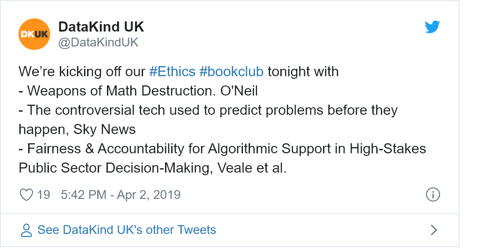

Impacts of Algorithms
================

Algorithm use in society with a particular emphasis on government uses
in the UK. This was a conscious choice as we are based in the UK and a
lot of the AI ethics coverage to date has been US-focused.

## Materials

### Materials for Book Club

1.  [**Weapons of Math
    Destruction**](https://weaponsofmathdestructionbook.com/). Cathy
    O’Neil, 2016. We kinda had to start with this, right? One of the
    books that got people talking about ethical issues with AI, data
    science etc. NOTE: This is a book that costs money\! If you want to
    buy it that’s great, but if anyone has a copy they can lend out then
    post here. Also check local libraries as a good resource\!

2.  [**The controversial tech used to predict problems before they
    happen**](https://news.sky.com/story/the-controversial-tech-used-to-detect-problems-before-they-happen-11649080).
    Manthorpe, 2019. A report from Sky News (**Warning\! auto-playing
    video**) This is a news report on a longer report on algorithm use
    on UK governments by the Data Justice Lab Cardiff. Read the Sky
    story, watch the news report, go dig out the 144-page pdf of the
    full report - it’s all good :)

3.  [**Fairness and Accountability Design Needs for Algorithmic Support
    in High-Stakes Public Sector
    Decision-Making**](https://arxiv.org/abs/1802.01029) - Veale et al.,
    2018. Journal article based on interviews with data scientists and
    others involved in creating and implementing those algorithmic tools
    in the UK - a chance to dig in to what goes on behind the scenes\!

### Further Reading

None

## Questions

### Pre-Event Prompt Questions

1.  Bring a memorable quote from the text you have read

### Facilitator Prompt Questions

## Outputs

### Live Tweets/Commentary

Open tweet in Twitter to see the discussion thread.
<!-- -->

### Blog

None for this first session

## Feedback

## Notes or other comments

First ever book club\! This one was run with DataKind UK attendees only
to iron out issues before opening them up.
