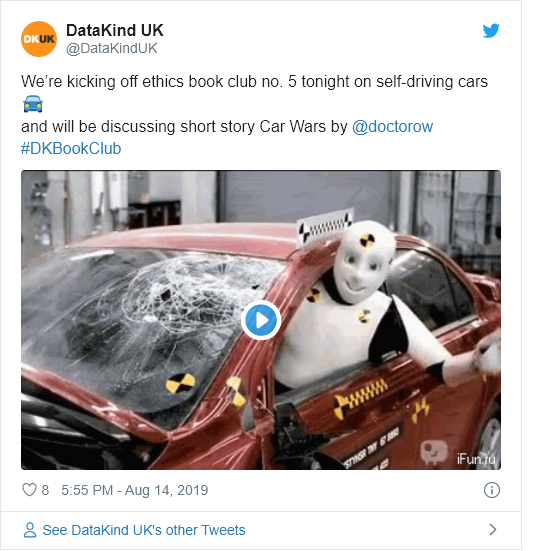
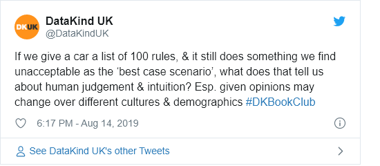
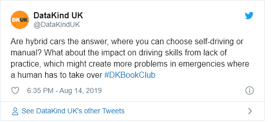

Self-Driving Cars
================

## Materials

### Materials for Book Club

This session we will be discussing **Self-Driving Cars**.

  - [**Car Wars**](https://this.deakin.edu.au/self-improvement/car-wars)
    **(Cory Doctorow 2016)**
  - Here’s an alternative shorter take from
    [Guardian](https://www.theguardian.com/technology/2015/dec/23/the-problem-with-self-driving-cars-who-controls-the-code)
    by the same author

### Further Reading

For those who want more….

*A primer*

  - And for those who would like it, a primer on self-driving cars:
    **Self-driving car technology explained to non experts**
    ([Medium](https://medium.com/swlh/everything-about-self-driving-cars-explained-for-non-engineers-f73997dcb60c))

*Impact on inequality *

  - [Academic paper](https://arxiv.org/pdf/1902.11097.pdf): Predictive
    Inequity in Object Detection *- systems unable to identify across
    skin colors. *
  - In this work, we investigate whether state-of-the-art object
    detection systems have equitable predictive performance on
    pedestrians with different skin tones. This work is motivated by
    many recent examples of ML and vision systems displaying higher
    error rates for certain demographic groups than others. We annotate
    an existing large scale dataset which contains pedestrians, BDD100K,
    with Fitzpatrick skin tones in ranges \[1-3\] or \[4-6\]. We then
    provide an in depth comparative analysis of performance between
    these two skin tone groupings, finding that neither time of day nor
    occlusion explain this behavior, suggesting\_ **this disparity is
    not merely the result of pedestrians in the 4-6 range appearing in
    more difficult scenes for detection** *. We investigate to what
    extent time of day, occlusion, and reweighting the supervised loss
    during training affect this predictive bias.*
  - See also news article on this paper, A new study finds a potential
    risk with self-driving cars: failure to detect dark-skinned
    pedestrians
    ([*Vox*](https://www.vox.com/future-perfect/2019/3/5/18251924/self-driving-car-racial-bias-study-autonomous-vehicle-dark-skin)\_,
    March 2019)
  - Research paper: Self-Driving Cars: The Impact on People with
    Disabilities ([Ruderman
    Foundation](https://rudermanfoundation.org/white_papers/self-driving-cars-the-impact-on-people-with-disabilities/),
    January 2017)

*Questions of morality….*

  - Interactive scenarios: The Moral Machine
    ([MIT](http://moralmachine.mit.edu/))
      - Academic paper: The Moral Machine Experiment
        ([Nature](https://www.researchgate.net/publication/328491510_The_Moral_Machine_Experiment),
        November 2018) - \_this article lays some interesting
        foundations on the absence of universal moral rules (differing
        by country).
      - See also the review of the paper, providing some more context:\_
        Self-driving car dilemmas reveal that moral choices are not
        universal
        ([Nature](https://www.nature.com/articles/d41586-018-07135-0#ref-CR1),
        October 2018)
      - News article: Will your driverless car be willing to kill you to
        save the lives of others?
        ([Guardian](https://www.theguardian.com/science/2016/jun/23/will-your-driverless-car-be-willing-to-kill-you-to-save-the-lives-of-others),
        June 2016) *People like utilitarian view in theory, but don’t
        want to buy a car programmed that way*

*Industry responses*

  - News article: 11 companies propose guiding principles for
    self-driving vehicles ([Venture
    Beat](https://venturebeat.com/2019/07/02/self-driving-car-report-safety-first-for-automated-driving/),
    July 2019)
  - Comment piece: Bob Lutz: Kiss the good times goodbye ([Automotive
    News](https://www.autonews.com/article/20171105/INDUSTRY_REDESIGNED/171109944/bob-lutz-kiss-the-good-times-goodbye),
    November 2017) - *Bob Lutz (ex-head of General Motors) gives a
    summary of where he thinks things might be heading *

*Technical challenges and solutions *

  - Mobileye CEO Amnon Shashua's recent lecture at MIT on the challenges
    of reaching full autonomy
    ([video](https://cbmm.mit.edu/video/successes-and-challenges-modern-artificial-intelligence))
  - The challenge of adversarial attacks
    ([article](https://www.technologyreview.com/s/613170/emtech-digital-dawn-song-adversarial-machine-learning/))
  - Mobileye’s 2018 [paper](https://arxiv.org/pdf/1708.06374.pdf) laying
    out a reasonable model of self-driving behavior

## Questions

### Facilitator Prompt Questions

  - Discuss whether Fictional stories have a place to discuss ethical
    consequences

  - Discuss whether you can boil down self-driving cars to the trolley
    problem? Is this possible, if so why not?

  - Reflect on how you felt about the trolley problem, before and after
    the reading. Discuss if your view has remained the same or changed
    accordingly.

  - Can a manufacturer stop you from changing its programming so that
    your car can never kill you?

  - Discuss whether an owner should hold responsibility for the
    self-driving car if there is an accident? Who else should take
    responsibility? Why?

  - Would you modify the software in your self-driving car to protect
    yourself, even if it was against the law?

  - Can self-driving and ‘dumb’ cars co-exist on the roads?

  - When buying a product embedded with technology, who owns the
    product? The code? Why?

  - Discuss the following statement: *“If self-driving cars can only be
    safe if we are sure no one can reconfigure them without manufacturer
    approval, then they will never be safe.”*

## Outputs

### Live Tweets/Commentary

For tweets from the evening see
[here](https://twitter.com/search?q=\(%23dkbookclub%20OR%20%23dkethicsbookclub\)%20until%3A2019-08-16%20since%3A2019-08-14&src=typed_query&f=live).

<!-- --><!-- --><!-- -->

### Blog

## Feedback

## Notes or other comments

This was our first try of a book club event with one main reading and
then various other sources “for interest”. Also our first one using
fiction\! The *Car Wars* piece was quite good as an unusual jumping-off
point for the discussion.
