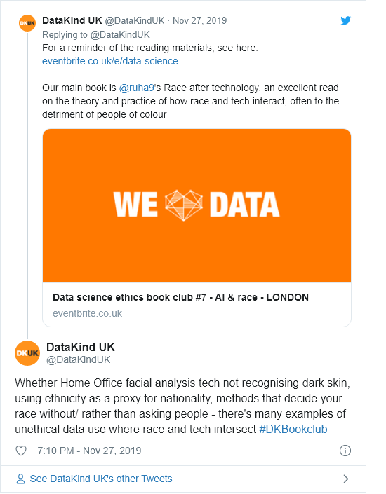
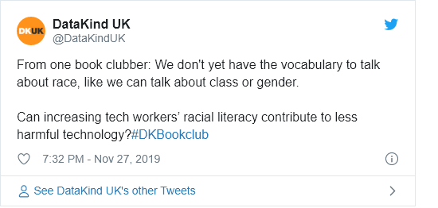

AI & Race
================

## Materials

### Materials for Book Club

Our next data science ethics bookclub is on *AI and Race.* **You are
welcome to pick from this reading list, depending on your interest and
the time you have:**

**Main read Book:** Ruha Benjamin, Race After Technology

**Journal Article:** Sebastian Benthall & Bruce D. Haynes. **Racial
Categories in machine learning** -
<https://arxiv.org/pdf/1811.11668.pdf>

**Quick reads** Jessie Daniels, Mutale Nkonde, Darakhshan Mir
**Advancing Racial Literacy in Tech- Why ethics, diversity in hiring and
implicit bias trainings aren't enough.**
<https://datasociety.net/wp-content/uploads/2019/05/Racial\_Literacy\_Tech\_Final\_0522.pdf>

Karen Hao, **This is how AI bias really happens—and why it's so hard to
fix. MIT Technology Review**
<https://www.technologyreview.com/s/612876/this-is-how-ai-bias-really-happensand-why-its-so-hard-to-fix/>

**Short watch** **Poetry:** Poem performed by Joy Buolamwini, AI,
**Ain't I A Woman?** <https://www.notflawless.ai/> **Talk:** Safiya
Noble, author of Algorithms of Oppression provides a short discussion of
her book <https://youtu.be/6KLTpoTpkXo> **Comedy sketch:** Full Frontal
with Samantha Bee. Correspondant Sasheer Zamata discusses bias
<https://youtu.be/AxpWvMrPqVs>

## Questions

### Facilitator Prompt Questions

**Note:** Facilitator prompts for the AI and Race book club are
intentially structured and detailed compared with a lot of the other
topics. We were aware of the risks around discussing this topic in terms
of having challenges to people’s lived experiences and allowing multiple
voices, and the aim of some of the definitions and prompts was to create
“ground rules” for the discussion.

**Warm up**

  - Which of the materials from the recommended reading list did you
    read/watch? What were your main takeaways?

**Discrimination in AI systems**

  - The tech sector seem to be converging (?) on the point that
    technology is not neutral. It codifies the viewpoints and biases of
    those who create the technology. Discuss the examples you have seen
    of inbuilt biases which directly or indirectly affect people of
    colour. Prompts
    
      - Pornographic images were returned when black girls, latina girls
        and asian girls were placed in Google search terms. (Reference:
        Safiya Noble)
      - Facial recognition technology are more inaccurate on people of
        colour. (Reference: Joy Boulamwini)
      - When placing ‘black- sounding’ names e.g. Latanya into a Google
        search, adverts suggesting a criminal record appeared more often
        than when ‘white-sounding’ names (Reference: Latanya Sweeney
        [eg](https://www.technologyreview.com/s/510646/racism-is-poisoning-online-ad-delivery-says-harvard-professor/))
      - Facebook targets job ads against ethnic minorities and genders
        etc even when advertisers don't ask for that. (See article from
        [Biddle](https://theintercept.com/2019/04/03/facebook-ad-algorithm-race-gender/))
      - Risk assessment tools in criminal justice which give a higher
        likelihood that ethnic minorities will be bail risks and will
        re-offend (e.g ProPublica) and which do not account for the
        societal biases encoded within the data

  - Proxies: Even if/when race isn't being explicitly used as a factor,
    are there proxies in the data? e.g. location, name, other correlates

  - In what ways are AI/algorithmic systems worse than the status quo
    (human decisions that may have their biases in etc)?
    
      - Is there potential for AI to be an improvement? In what
        situations/how?

**Racial literacy**

There are several ways in which tech design delivers racist outputs.
Ruha page 160 summarises it into 3 ways. Designs that:

1)  ‘explicitly work to amplify hierarchies’;

2)  ‘ignores and thus replicate social divisions’

3)  aim to fix racial bias but end up doing the opposite.

**Can increasing tech workers' racial literacy contribute to less
harmful technology? Discuss **

Daniels, Nkonde, Mir discuss the need for racial literacy in tech. This
is formed of three concepts:

1.  An intellectual understanding of how structural racism operates in
    algorithms, social media platforms, and technologies not yet
    developed. Includes six concepts:

2.  Racism is a current problem, not a historical one;

3.  Race intersects with class, gender, and sexuality;

4.  Racial identities are learned from social practices;

5.  A vocabulary is necessary to discuss race, racism, and antiracism;

6.  Racial codes and practices must be accurately interpreted;

7.  “Whiteness” has a symbolic value in society.

8.  An emotional intelligence concerning how to resolve racially
    stressful situations within organizations. The need to move through
    phases:

9.  Denial – I don't see a problem here.

10. Absence – I'd rather stay out of racial discussions.

11. Confessional – I am beginning to understand racism and feel
    compelled to share that with everyone around me.

12. Comfortable – I am able to recognize structural racism.

13. Transformational – I am committed to work on stopping the harm of
    racism.

14. A commitment to take action to reduce harms to communities of color.

**Race and AI work**

  - The tech industry - those making AI systems - is traditionally not
    the same people as those being impacted by AI and tech systems
    (white, male, based in global north, high socioeconomic background).
    Do you think who makes the products makes a difference?

  - Studies show that having a diverse workplace supports more
    innovation and there is a financial dividend (Ref in: Daniels,
    Nkonde, Mir). How has the tech industry sought to increase racial
    diversity in the work place?
    
      - Have you seen any examples from your work place or externally?
      - Is there more work to be done?

  - Benjamin (page 28) provides an example from a former Apple employee
    who worked on developing speech recognition for Siri. They worked on
    different English dialects- Australian, Singaporean, and Indian
    English. The employee asked his boss What about African American
    English and the boss responded that Apple products are for the
    premium market. This happened in 2015. How do you think that
    employee felt in that situation? What would you have done?
    
      - This example illustrates the interplay of racism and capitalism-
        where ethnic minorities when treated as a single homogenous
        group are deemed to have less purchasing power and therefore not
        considered to be a market of interest. What is technology's role
        in reducing inequality in society? Prompts
          - Tech workers protest against creating software for US
            Immigrations, Customs and Enforcement

  - There are also the non tech worker's working in the tech industry to
    consider. Often they are people of colour (we can all expand this to
    all working class people) on insecure employment terms and low
    wages. On Tuesday workers from one Amazon warehouse worked out.
    There are other examples (can prompt groups to discuss). What should
    be done to provide better work conditions for these workers? Prompt:
    legislation, unions…

## Outputs

### Live Tweets/Commentary

For tweets from the evening see
[here](https://twitter.com/search?q=\(%23dkbookclub%20OR%20%23dkethicsbookclub\)%20until%3A2019-11-28%20since%3A2019-11-26&src=typed_query&f=live).

<!-- --><!-- -->

### Blog

[Race: the elephant in the room that never goes
away](https://medium.com/datakinduk/race-the-elephant-in-the-room-that-never-goes-away-691b48cc7e95)

## Feedback

## Notes or other comments
